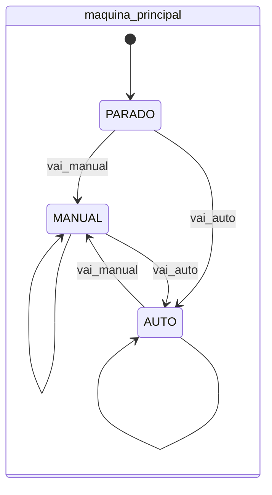
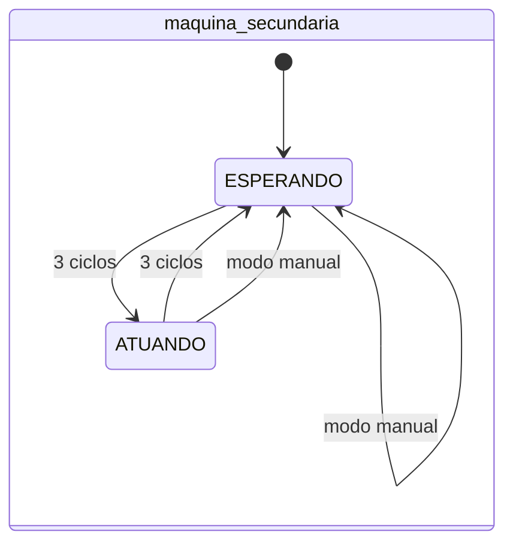

# Máquina de Estados Hierárquica

Esta atividade busca exercitar mais os conceitos de máquinas de estado. Nela, deve ser construído um sistema com duas máquinas de estado, uma subordinada à outra.

## Controlador de Equipamento Automatizado

Para ser mais fácil de imaginar a situação, a máquina de estados principal é responsável por controlar um sistema industrial automatizado que realiza uma tarefa. Esta tarefa é ligar uma caldeira como parte do processo industrial de fabricação de um produto.

A máquina principal tem duas opções: operar manualmente ou então operar automaticamente utilizando uma máquina de estados secundária. Quando a máquina principal está no modo manual, a secundária fica parada. Somente quando o modo automático é ligado que a máquina secundária deve atuar.

## Funcionamento da FSM principal

Na máquina de estados principal, quando o modo for manual, o sinal de entrada `ligar_caldeira` deve atuar diretamente no sinal de saída `caldeira`. Isto significa que o sinal de entrada atua imediatamente na saída. No modo automático, quem controla a saída `caldeira` é a máquina secundária.

A máquina de estados principal inicia no estado PARADO (no qual a caldeira é sempre nível baixo) e, dependendo das entradas `vai_manual` e `vai_auto`, pode ir para o modo MANUAL ou AUTO. Veja o diagrama da máquina principal.

Se a máquina já estiver no modo manual, por exemplo, ela muda para o modo automático caso o sinal `vai_auto` seja acionado. Além disso, quando o sinal de reset (ativo em nível alto) é acionado, a máquina volta para o estado parado.

## Funcionamento da FSM secundária

A FSM secundária liga e desliga a caldeira de maneira automática. O sinal `caldeira` fica ligado por **três** ciclos de relógio e fica desligado pelo mesmo tempo. Para fazer isso, esta FSM usa um contador interno.

A FSM tem dois estados: ESPERANDO e ATUANDO. No primeiro estado o sinal da caldeira fica em nível baixo e no segundo fica em nível alto. 

Caso a FSM principal esteja no modo manual, a FSM secundária deve ficar parada no estado ESPERANDO. Se a principal estiver no modo automático a FSM secundária deve ficar alternando entre os estados a cada **três** ciclos de relógio.

Veja um diagrama da máquina de estados secundária:

## Atividade

Desenvolva as duas máquinas de estado interligadas para realizar o controle da caldeira. É importante observar que o sinal de controlar a `caldeira` hora é controlado pela principal, hora é controlado pela automática. Será necessário criar uma lógica para dividir o controle entre as máquinas.

## Execução da atividade

Siga o modelo de módulo já fornecido e utilize o testbench e scripts de execução para sua verificação. Em seguida, implemente o circuito de acordo com as especificações e, se necessário, crie outros testes para verificá-lo.

Uma vez que estiver satisfeito com o seu código, execute o script de testes com `./run-all.sh`. Ele mostrará na tela `ERRO` em caso de falha ou `OK` em caso de sucesso.

## Entrega

Realize um *commit* no repositório do **GitHub Classroom**. O sistema de correção automática vai validar sua implementação e atribuir uma nota com base nos testes.

> **Dica:**  Não modifique os arquivos de correção! Para entender como os testes funcionam, consulte o script `run.sh` disponível no repositório.

